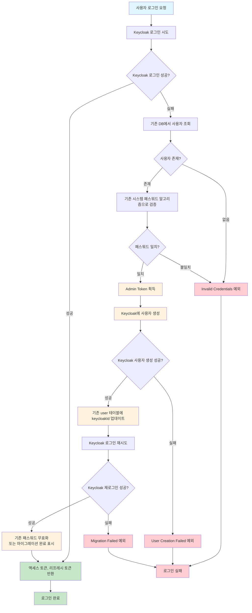

# Keycloak 인증 시스템 마이그레이션 계획서

## 1. 개요

### 목적

- 기존 Django 기반 세션 인증을 Keycloak 기반 JWT 토큰 인증으로 전환
- 백엔드/프론트엔드 분리 아키텍처 구축을 위한 인증 시스템 현대화
- 사용자 서비스 중단 최소화와 함께 점진적 마이그레이션 실현

### 마이그레이션 전략

**"강제 로그아웃 + 점진적 사용자 마이그레이션"** 방식 채택

- 배포 시점에 모든 기존 사용자 강제 로그아웃 (한 번의 불편함 감수)
- 이후 로그인 시도 시 자동으로 Keycloak 시스템으로 마이그레이션
- 리프레시/로그아웃 등 모든 토큰 관리는 Keycloak 기반으로 통일

## 2. 현재 상태 분석

### 기존 시스템

- **인증 방식**: Django 세션 기반 인증
- **사용자 데이터**: `auth_user` 테이블 (username, password, email, firstName, lastName)
- **패스워드 알고리즘**: Django 기본 알고리즘 (PBKDF2, bcrypt 등)

### 목표 시스템

- **인증 방식**: Keycloak JWT 토큰 기반 인증
- **토큰 관리**: 액세스 토큰 + 리프레시 토큰
- **사용자 데이터**: Keycloak + 기존 DB 연동 (keycloakId 추가)

## 3. 마이그레이션 플로우



## 4. 구현 계획

### 4.1 데이터베이스 스키마 변경

```sql
-- auth_user 테이블에 Keycloak 연동 컬럼 추가
ALTER TABLE auth_user
    ADD COLUMN keycloak_id VARCHAR(36) NULL,
ADD COLUMN is_migrated BOOLEAN DEFAULT FALSE,
ADD COLUMN migrated_at TIMESTAMP NULL;

-- 인덱스 추가
CREATE INDEX idx_auth_user_keycloak_id ON auth_user (keycloak_id);
CREATE INDEX idx_auth_user_is_migrated ON auth_user (is_migrated);
```

### 4.2 핵심 컴포넌트 구현

#### AuthService 확장

- `login()`: 위 플로우에 따른 하이브리드 로그인 처리
- `refreshToken()`: Keycloak 기반 토큰 갱신
- `logout()`: Keycloak 기반 로그아웃

#### LegacyPasswordService 신규 개발

- Django 패스워드 알고리즘 검증 로직
- 지원 알고리즘: PBKDF2-SHA256, bcrypt, Argon2

#### UserResourceCoordinator 확장

- `migrateUserToKeycloak()`: Keycloak 사용자 생성 및 DB 연동

### 4.3 보안 설정

- Spring Security OAuth2 Resource Server 설정
- Keycloak JWT 검증 및 권한 매핑
- 기존 세션 인증 미들웨어 제거

## 5. 배포 계획

### 5.1 사전 준비

- [ ] Keycloak 서버 구축 및 설정
- [ ] 백엔드 API 개발 완료
- [ ] 프론트엔드 로그인 페이지 개발
- [ ] 스테이징 환경에서 전체 플로우 테스트

### 5.2 배포 순서

1. **백엔드 API 배포**
    - 새로운 인증 시스템 활성화
    - 기존 세션 인증 비활성화
2. **프론트엔드 배포**
    - JWT 토큰 기반 인증 로직 적용
    - 로그인 페이지 교체
3. **사용자 안내**
    - 서비스 공지사항 게시
    - 재로그인 안내 메시지

### 5.3 배포 후 모니터링

- 로그인 성공/실패율 모니터링
- 마이그레이션 진행률 추적
- 에러 로그 및 사용자 피드백 수집

## 6. 점진적 마이그레이션 절차

### 배포 직후 (Day 0)

- **상황**: 모든 기존 사용자 로그아웃 상태
- **사용자 경험**: 재로그인 필요 안내

### 초기 단계 (Day 1-3)

- **활성 사용자들이 순차적으로 로그인 시도**
- **마이그레이션 진행률**: 30-50% 예상
- **모니터링 포인트**: 로그인 실패율, 에러 발생 현황

### 안정화 단계 (Day 4-7)

- **대부분의 활성 사용자 마이그레이션 완료**
- **마이그레이션 진행률**: 80-90% 예상
- **남은 사용자**: 비활성 사용자 위주

### 완료 단계 (Week 2-4)

- **장기 비활성 사용자들도 점진적 마이그레이션**
- **마이그레이션 진행률**: 95%+ 예상
- **정리 작업**: 미사용 레거시 코드 제거 검토

## 7. 위험 요소 및 대응 방안

### 7.1 주요 위험 요소

| 위험 요소          | 영향도 | 발생 가능성 | 대응 방안                 |
|----------------|-----|--------|-----------------------|
| Keycloak 서버 장애 | 높음  | 낮음     | Keycloak 이중화, 헬스체크 강화 |
| 대량 동시 로그인      | 중간  | 높음     | 로그인 API 부하 테스트, 스케일링  |
| 레거시 패스워드 검증 오류 | 높음  | 중간     | 다양한 패스워드 알고리즘 테스트     |
| 사용자 불편 사항      | 중간  | 높음     | 명확한 안내 메시지, 고객지원 준비   |

### 7.2 롤백 계획

- **조건**: 치명적 오류 발생 시 (로그인 실패율 50% 초과)
- **절차**:
    1. 기존 Django 세션 인증 재활성화
    2. 프론트엔드 이전 버전 롤백
    3. 사용자 재안내 및 문제 해결 후 재배포

## 8. 성공 지표

### 8.1 기술적 지표

- **마이그레이션 완료율**: 95% 이상 (4주 내)
- **로그인 성공률**: 98% 이상
- **시스템 가용성**: 99.9% 이상
- **평균 응답시간**: 500ms 이하

### 8.2 사용자 경험 지표

- **로그인 실패로 인한 고객 문의**: 일 10건 이하
- **사용자 만족도**: 기존 수준 유지
- **서비스 이용률**: 배포 전 대비 95% 이상 유지

## 9. 일정 및 마일스톤

### 개발 단계 (4주)

- **Week 1-2**: 백엔드 API 개발 (AuthService, LegacyPasswordService)
- **Week 3**: 프론트엔드 로그인 시스템 개발
- **Week 4**: 통합 테스트 및 스테이징 검증

### 배포 준비 (1주)

- **Keycloak 프로덕션 환경 구축**
- **DB 스키마 변경 스크립트 준비**
- **모니터링 대시보드 구축**

### 배포 및 안정화 (4주)

- **Week 1**: 배포 및 초기 모니터링
- **Week 2-3**: 마이그레이션 진행 상황 추적
- **Week 4**: 안정화 및 최적화

## 10. 결론

이번 Keycloak 마이그레이션은 **점진적이면서도 명확한 전환점**을 제공하는 실용적인 접근법입니다.

**핵심 장점:**

- 복잡한 하이브리드 시스템 없이 깔끔한 전환
- 사용자별로 자연스러운 마이그레이션 진행
- 모든 토큰 관리 로직의 일관성 확보

**예상되는 사용자 영향:**

- 배포 시점의 일회성 재로그인 (수용 가능한 수준)
- 이후 기존과 동일한 로그인 경험 제공

이를 통해 현대적이고 확장 가능한 인증 시스템으로 안전하게 전환할 수 있을 것입니다.