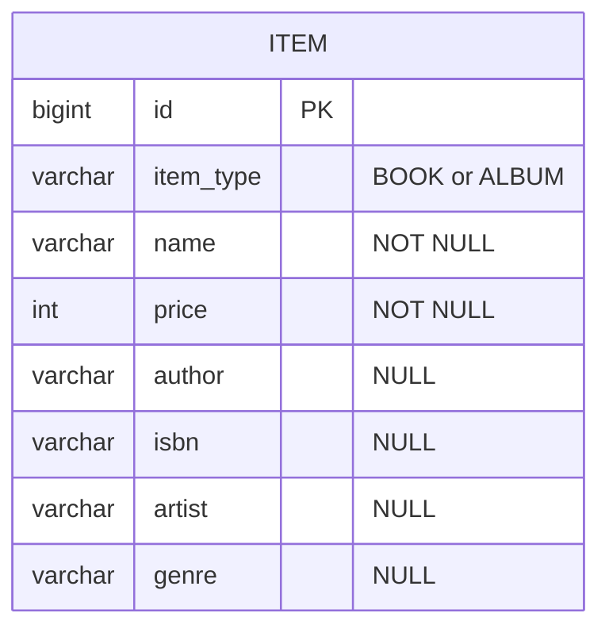
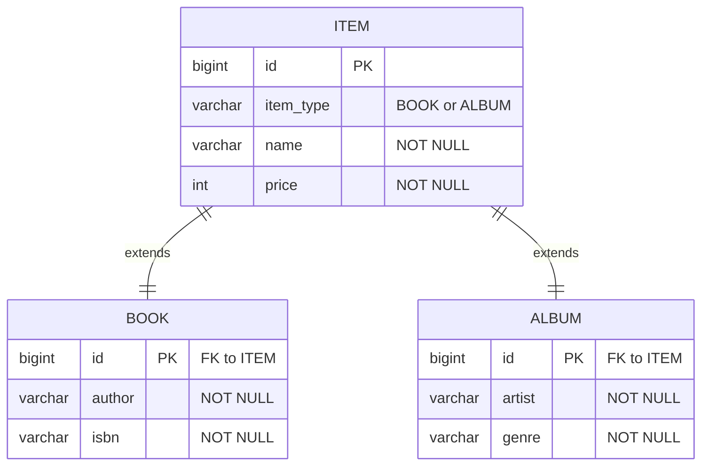
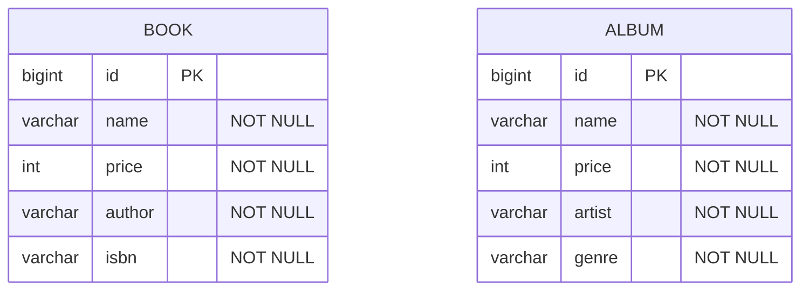

# 상속 매핑 전략

- InheritanceType.SINGLE_TABLE
    - 단일 테이블
    - 단순, 성능 우수
    - 자식 테이블을 생성하진 않지만 `@Entity` 애노테이션 필수
- InheritanceType.JOINED
    - 공통 테이블 + 구현체 테이블
    - 정규화된 설계로 조인 필요
    - 자식 엔티티에서 부모 엔티티와 동일한 id 값을 사용하므로 자식 엔티티에서 id 선언하지 않음
    - 자식 테이블이 부모 테이블의 id를 참조하는 구조를 JPA가 자동 관리
- InheritanceType.TABLE_PER_CLASS
    - 구현체 테이블
    - 공통 테이블이 없으므로 공통 조회는 UNION 사용 - 비효율적으로 거의 사용 안 함

## SINGLE_TABLE 전략

```java

@Entity
@Inheritance(strategy = InheritanceType.SINGLE_TABLE)
@DiscriminatorColumn(name = "ITEM_TYPE")
public abstract class Item {

    @Id
    @GeneratedValue
    private Long id;
    private String name;
    private int price;
}

@Entity
@DiscriminatorValue("BOOK")
public class Book extends Item {

    private String author;
    private String isbn;
}

@Entity
@DiscriminatorValue("ALBUM")
public class Album extends Item {

    private String artist;
    private String genre;
}
```



## JOINED 전략

```java

@Entity
@Inheritance(strategy = InheritanceType.JOINED)
@DiscriminatorColumn(name = "ITEM_TYPE")
public abstract class Item {

    @Id
    @GeneratedValue
    private Long id;
    private String name;
    private int price;
}

@Entity
@DiscriminatorValue("BOOK")
public class Book extends Item {

    private String author;
    private String isbn;
}

@Entity
@DiscriminatorValue("ALBUM")
public class Album extends Item {

    private String artist;
    private String genre;
}
```



## TABLE_PER_CLASS

```java

@Entity
@Inheritance(strategy = InheritanceType.TABLE_PER_CLASS)
public abstract class Item {

    @Id
    @GeneratedValue
    private Long id;
    private String name;
    private int price;
}

@Entity
public class Book extends Item {

    private String author;
    private String isbn;
}

@Entity
public class Album extends Item {

    private String artist;
    private String genre;
}
```



# 펌뱅킹 다형성 설계 및 구현

- TABLE_PER_CLASS 전략은 여러 자식 테이블을 함께 조회할 때 UNION 사용으로 성능 문제가 있어 사용하지 않는다.
- SINGLE_TABLE 전략은 불필요한 조인이 없어 성능이 우수
  - 자식 엔티티가 매핑한 컬럼은 모두 null 허용 필요
  - 공통 가변 내용을 JSON 필드로 해결
- JOINED 전략은 N+1 문제를 철저하게 피할 수 있다면 사용 가능
  - QueryDSL을 효과적으로 사용하여 공통 정보만 목록 조회하여 N+1 문제 회피 가능한 경우
  - 도메인 모델 설계 전략
    - Composition:
      - 명확한 데이터 로딩 시점 구분 (공통 속성은 즉시, 전용 속성은 지연)
      - 기능 확장이 자유로움 (상속의 제약에서 자유)
      - 각 Provider별 구현의 자율성이 높음
      - 공통 속성과 전용 속성의 경계가 명확함
    - Inheritance:
      - 간결한 코드 구조
      - 공통 속성에 직접 접근 가능 (dozn.title)
      - 공통 속성 재정의 가능
      - LSP(Liskov Substitution Principle) 활용 가능

## 결론

- `SINGLE_TABLE` 상속 전략
  - 연동 정보 메타데이터는 JSON 필드
- 빈 리스트에서 알맞은 타입에 맞는 빈 선택